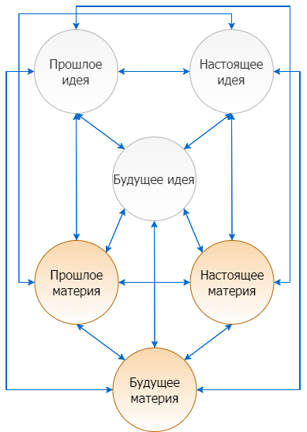

Tags: #lingva 

## Concepts
### Gaming social fractions IRL
| Темные (нежить) | Серые (жнецы)                                                                                  | светлые    | Невидимые (отшельники) |     |     |
| --------------- | ---------------------------------------------------------------------------------------------- | ---------- | ---------------------- | --- | --- |
| нечисть         | жнецы: следят за порядком и регулируют баланс света и тьмы своими темными и светлыми методами. | люди       | я                      |     |     |
| бесы            |                                                                                                | белые маги |                        |     |     |
| черти           |                                                                                                | ангелы     |                        |     |     |
| черные маги     |                                                                                                | архангелы  |                        |     |     |
| вампиры         |                                                                                                |            |                        |     |     |
| демоны          |                                                                                                |            |                        |     |     |
| архидемоны      |                                                                                                |            |                        |     |     |
| дьяволы         |                                                                                                |            |                        |     |     |
| архидьяволы     |                                                                                                |            |                        |     |     |                                                                               |            |                        |     |     |

### Universe methods of self-consideration and its overall sctructural form
#### Рисунки строения вселенной
![[UniverseFormV1.png]]

![[UniverseFormV2.png]]

#### Пресуппозиция:
вакуум: материя нематерия

степени мышления материи: возможно то что проявлено
степени мышления нематерии: возможно то что непроявлено
вакуум: возможно все

за пределами вакуума: невозможно все

За пределами вакуума нет бога,значит нет законов бога, значит там нет ни жизни, ни смерти.
За пределами у бога нет даже возможности к существованию, нет даже возможности его законов. За пределами бога нет 
системы, нет даже хаоса.

Вакуум характеризуется возможностью проявлений, как и Бог.

Но за вакуумом есть отсутствие вакуума. что еще один более высший Бог - по имени смерть.

А за ними двумя есть одновременная жизнь и одновременная смерть, одновременное существование и несуществование.

Бог есть лишь пока он есть, а третий мир есть и нет одновременно. Это его качество и не качество. Этот мир и все и ничего
его и не видно и видно издалека. В него невозможно попасть но очень просто открыть. Он парадокс. До него нельзя дойти,
но он может дойти до тебя. До него не добраться тому, кто ищет, но он добираетяс до тех, кто не смог найти. Это не
пустота, ни жизнь, ни смерть, это ни что и ни ни что у этого отсуствует определение и любое слово может это обозначить.
Это отсутствие неотсутствия, неотсутствие отсутствия, проявленность непроявляемого, непроявленность проявленного.
Бесконечность конечного, конечность без конца. В этот мир невозможно войти, но этот мир может войти в человека.
Это мир наоборот и при этом такой же, он парадокс и при этом последователен. От двери в этот мир нет ключа, но мир
сам является ключом. Я не найду сюда вход, но он найдет вход в меня. Я никогда туда не попаду, но попал туда сейчас.
Я не знаю, что мне теперь делать, но теперь мне делать ничего и не нужно, потому что мир поведет меня сам.
Я не знаю, какое мышление соответствует этому миру, но этот мир парадокс и его мышление парадоксально.

В этом мире вещи все наоборот, но при этом являются сами собой. Если в этом мире я захочу понять мышление парадокса,
то для начала парадокс должен понять меня. Чтобы парадокс меня понял я ничего не должен ему объяснять. 
Невозможный мир нереально описать, ведь все в нем и существует и не существует одновременно, но чтобы существовать в нем
надо быть и не быть одновременно. Но так как этот мир во мне уже есть и его там нет, то я уже в нем и не в нем, а если
я в нем и не в нем, значит этот мир уже во мне. Этот мир сам по себе условен и безусловен он бесформенен и имеет очертания
он зеркало и в нем все существует на правах зеркала.

Представим ситуацию, допустим у меня есть девушка и я с ней строю любовь, какие мои действия соответствуют какому миру.
Материя: внешностью любви есть ее доказательство, нематерия: вера в любовь есть ее доказательство.
Вакуум: возможность любви есть ее доказательство, сам потенциал доказательство изначально заложенной любви.

Зеркало: нелюбовь есть любовь наоборот, значит отсутствие любви является доказательством любви наоборот. Потому что
любое качество обратно самому себе и является обратным. Любовь это ненависть наоборот, смерть это жизнь наоборот, вакуум
это отсутствие вакуума. Все есть и всего нет.

Значит есть 4 логики мира:
демоническая - материальная
ангельская - нематериальная
божественная - вакуумная
бога смерти - отсутствие вакуума
зеркальная - существование несуществуемого, одновременная возможность и невозможность всего возможного и невозможного.
полное отсутствие границ условностей и системы при их наличии. Это значит что границы в этом мире служат лишь описательной 
цели, но при этом изначально считается что их нет.

Отражение в зеркале: оно есть но его нет, оно имеет формы и при этом не имеет, оно является мной но противоположно мне,
оно это я и не я, оно содержит и не содержит меня.

Есть 5 способов решения вопросов: демонический, ангельский, божественный, бога смерти, зеркальный.

Каждый из способов что выше дает решение более качественное но менее проявленное в качестве нижнего уровня.
Пример мне нужен дом, по-божественному: земля и есть мой дом и это решение более качественное, но менее проявленное
чем реальный дом в демоническом решении.

#### Виды вселленской логики
Виды логики для разных миров, где каждый высший мир властвует над низшим, но где каждый метод наиболее визуально проще проявляется и виден на том уровне, на каком находится его мир. Это значит, что методы более высшего мира лучше работают для более мелких задач, но хуже фиксируются, поэтому из концепции прагматизма миру должна применяться его же методология решения проблем для максимального проявления результата(не самого результата, но его проявления).

Демоническая: мистический ноктюрн, драматический ноктюрн, логема, логистика
Объект: обязательно проявленная и измеримая сущность
Субъект: демон или падший человек
Метод логического мышления: секуляризм и разделение 
Цель: полезный проявленный материальный измеримый результат
Парадигма: материальный мир
Демоническая логика наилучшая для решения МАТЕРИАЛЬНЫХ ЗАДАЧ.
Феномен: на этом уровне начинает существовать понятие факт (как единичный правдиво зафиксированный случай 
материального проявления природы).

Человеческая: логика, логос, диурн
Объект: сущность
Субъект: человек
Метод логического мышления: секуляризм и разделение 
Цель: истина
Парадигма: материальный и идеальный мир
Человеческая логика наилучшая для решения ФИЛОСОФСКИХ ЗАДАЧ.
Феномен: на этом уровне начинает существовать понятие своей относительной человеческой правды (относительной
для каждого человека).

Ангельская: мыслеформы как принципы мироздания, выраженные в священных писаниях
Объект: мыслеформа
Субъект: ангел или святой
Метод логического мышления: холизм и аллегорическое познание, эмпиризм
Цель: истина
Парадигма: материальный и идеальный мир
Ангельская логика наилучшая для решения ЗАДАЧ УСТАНОВЛЕНИЯ АБСОЛЮТНОЙ ИСТИНЫ ДЛЯ ЧЕЛОВЕЧЕСТВА.
Феномен: на этом уровне начинает существовать понятие относительной истины для разных божественных тварей. 
(абсолютной для разных классов существ, но относительной среди самих классов)

Божественная: релятивизм через расширение возможностей для существования чего либо
Объект: мир вакуума
Субъект: бог(вакуум)
Метод логического мышления: хаос
Цель: возможность истины и ее проявлений
Парадигма: мир вакуума
Божественная логика наилучшая для решения ЗАДАЧ УСТАНОВЛЕНИЯ ГРАНИЦ(ВРЕМЕНИ И МЕСТА), СУТИ ИСТИНЫ, ФОРМ ИСТИНЫ, 
ПРИНЦИПОВ ЕЕ ВОЗДЕЙСТВИЙ, ВЗАИМОДЕЙСТВИЯ ВНУТРИ СЕБЯ И ОГРАНИЧЕНИЙ(ДЛЯ ИЗУЧЕНИЯ НЕ ТОГО, ЧТО ЯВЛЯЕТСЯ ИСТИНОЙ, А
УСТАНОВЛЕНИЯ СТРУКТУРЫ ИСТИНЫ, ЕЕ СКЕЛЕТА).
Феномен: на этом уровне начинает существовать понятие абсолютной божественной истины (через ее абсолютные границы).

Смертельная: логика невозможности и конечности чего-либо через определение границ, форм и критериев объектов
Объект: мир вакуума и отсутствия вакуума
Субъект: бог смерти
Метод логического мышления: невозможность и негативизм при крайней форме секуляризма, работа с условностями,
определенными временно и лишь в системе чего-либо(объект вне системы лишается значения и не может быть обозначен или
осмыслен, поскольку вне системы возможна лишь смерть)
Цель: ограничение истины во времени и форме
Парадигма: мир вакуума и отсутствия вакуума
Смертельная логика наилучшая для решения задач по нахождению АБСОЛЮТНОЙ НЕ ИСТИНЫ КАК ЭЛЕМЕНТА, ВЫПАДАЮЩЕГО ИЗ
ЛЮБОЙ СИСТЕМЫ ИСТИНЫ. (ТО ЕСТЬ НАХОЖДЕНИЕ ЛЖИ ПО СРАВНЕНИЮ ОБЪЕКТА С ТЕМ, В РАМКАХ КАКОЙ ИСТИНЫ ОН МОЖЕТ СУЩЕСТВО-
ВАТЬ, И ЕСЛИ НИКАКОЙ, ТО ЭТО АБСОЛЮТНАЯ ЛОЖЬ).
Феномен: на этом уровне начинает существовать понятие абсолютной лжи.

Зеркальная(логика чудес): логика одновременного присутствия и небытия невозможности и возможности, парадоксальня 
и обратная логика для нахождения того, чего не может существовать, но существует
Объект: не определен и определен одновременно
Субъект: зеркальное отражение
Метод логического мышления: парадоксальное существование несуществуемого и несуществование существуемоего
Цель: есть и отсуствует одновременно
Парадигма: есть и нет одновременно

ОДНО ОЧЕНЬ ВАЖНОЕ ПРАВИЛО: ГОВОРИТЬ ДРУГИМ МОЖНО ТО, ЧТО НА ИХ УРОВНЕ ПОНИМАНИЯ ИЛИ НИЖЕ ИХ УРОВНЯ,
НО ТО, ЧТО ВЫШЕ, МОЖНО ЛИШЬ ЕСЛИ НА 1 УРОВЕНЬ ВЫШЕ И ТО ИЗРЕДКА, ЕСЛИ СУЩЕСТВО ГОТОВО К ПОНИМАЮ ХОТЬ КАК ТО.

ВСЕ ОСТАЛЬНЫЕ ЗНАНИЯ И ДАЮЩИЕСЯ БОЛЕЕ ЧАСТО ЭТО ЗАПРЕТНЫЕ СМЕРТЕЛЬНЫЕ ЗНАНИЯ, ОНИ МОГУТ РАЗРУШИТЬ ВСЕ НА СВЕТЕ.
ЭТО СМЕРТЕЛЬНО ОПАСНЫЕ ЗНАНИЯ. 

Пример операций над рассуждениями в виде разных логик, где высшая всегда бьет младшую и более
истинна, но хуже проявлена:
Допустим, мы хотим установить истинный ответ на какой-либо популярный вопрос, например, может ли женщина
иметь права равные мужчине.
Вот ответы разных логик(ее выводы):
1) Демоническая: женщина подобна смерти и ее права выше мужских < женщина подобна матери и ее права равны <
женщина может выбирать себе любые права (так как она отдельный индивид) < женщина может выбрать те права, что она
выбьет, в борьбе с мужчинами
2) Человеческая: женщина исторически неприспособлена для тех же прав и обязанностей как и мужчина, у нее должно быть 
прав и обязанностей < женщина природой не предназначена для тяжелой мужской жизни, она по природе раб своей похоти <
женская природа - принятие и подчинение сильному, то есть она не способна быть самостоятельнее ребенка 12 лет,
такие у нее должны быть права
3) Ангельская: женщина - ребро адама, при том первая сорвавшая запретный плод, первая поддавшаяся искушению и искусившая
Адама, она по рождению ниже мужчины (она его придаток и не более, верный слуга в лучше случае, только часть тела, и то
испорченая, подведшая с самого начала, предатель с рождения).
4) Божественная: человеческая женщина создана лишь для помощи мужчине, для его жизни (ни для чего более, ее судьба - 
быть слугой мужчины и при этом использовать его, чтобы он донес ее на спине к воротам рая, ведь сама она не способна это,
лишь на то, чтобы затянуть в ад, женщина - случайность и одна из ошибок Бога, неудавшихся подарков мужчине).
5) Смертельная: женщина - цветок зла и ничто не может это изменить, она либо утянет на дно челочество, либо вымрет,
освободив мужскую часть человества от своей внутренней отравы, которую может усмирить только смерть, потому что
женщина не может жить без зла, она и есть зло
6) Зеркальная: женщина может иметь любые права, но они ей недоступны, женщина это мужчина наоборот, насколько он смог
достигнуть подняться, настолько она сможет упасть, женщина это ангельская форма самой настоящей смерти вдохновляющей 
мужчин на жизнь ради того чтобы забрать эту жизнь у них, женщина настолько же слуга Бога для мужчины, насколько слуга
дьявола для себя и смерти. смысл жизни женщины был продиктован Богом для помощи мужчине, но она решила помочь лишь уйти
в царство смерти и порока, увлекая всех мужчин за собой, прямо туда. женщина человеческая якобы человек, но она просто
неудачная подделка демонической женщины Лилит в человеческом облике. Да она противоположна Лилит-демону, как человек,
но лишь из-за своего несовершенства в зле. Мужчина это полуангел, женщина это недоангел и полудемон. Лучший друг мужчины
в виде женщины является его практически худшим врагом.

### Multiverse theory

Вопросы определения личности

Кто я?

Что я имею?

Что я делаю?

Проблемы намеченные:
Разрушенная картина персоналии - Разрушенная картина возможностей - Разрушенная картина желаний - Разрушенная картина методов достижения - 
- Разрушенная картина целей - Разрушенная картина жизни

Общее описание проблемы:
Потеря темной личности (как основной и единственной), отсюда разрушенная картина персоналии

Полная потеря понимания, что правильно, где добро, а где зло, и что я такое

Теоретические возможные вопросы для последующего определения личности:

Направленные внутрь себя
Определение себя через центр в себе

Определение себя через центр в себе духовный
Определение себя через центр в себе материальный

Направленные вовне
Определение себя через центр в чем-то другом

Определение себя через центр в мире духовный
Определение себя через центр в мире материальный

Допустим, что нужно определить себя, но как может трехмерный человек увидеть свою трехмерную структуру, ведь только четырехмерный человек может определить трехмерного.
Только автор рисунка может определить рисунок, увидев его проекцию в трехмерном мире (хоть рисунок и 2-мерный). Определить объект полностью можно только по его проекции на мир выше.

Как определить 3-мерного человека? По его проекции на мир выше - 4 мерный. Какая эта проекция? Мир ли это чувств или материи или чего?
Может, я и не 4 мерный человек, но я могу смоделировать проекцию по физическим законам.
Материальная или нет эта проекция? Но вопрос материи стоит в 3-мерном мире, который ограничен физическими законами. 4-мерный мир тоже ограничен физическими законами, но в нем
нематериальное может становиться материальным и наоборот. Это мир магии физических законов. Материальный мир начинает вести себя как нематериальный.

Как войти в 4 мерный мир, если прямой путь в 3-мерном мире туда не ведет, ведь только если войти можно увидеть проекцию. Рисунок не может войти в 3-мерный мир, но как
он может представить свою проекцию в 3 мерный мир?

Надо представить степень свободы. Эта степень свободы материальна по сути, но кажется нематериальной для мира той-мерности, где находится сам объект.

Проекция на степень этой "нематериальной свободы" и является проекцией 3мерного объекта на 4мерный мир.
Черт, я понял, квадрат не может выйти в мир, где обитает куб, не потому что у него там нулевая координата объема, а потому что он не может расширить эту координату,
представив свою проекцию в нематериальный мир для своей мерности. он не может там себя осознать. но его осознание хоть и не дает ему больше нуля в той мерности
да, но уже перемещает, а так как перемещенеи это проявление, то он будет нулевым, но оно будет и оно даст влияние.

Что является нулевой координатой для 3 мерного мира?
Где расширение возможно:
материя, время, скорость
Где расширение невозможно?
Расширение невозможно там, где не существует меры. Даже для идей есть меры. Но для чего меры нет? Где есть только нулевая мера?
Минуточку, ведь 3 измерение добавляет несколько 2 измерений.

А значит 4 измерение добавит несколько 3 измерений, а они будут являться материально-нематериальными. Это и есть мир магии. Материя становится нематерией и наоборот.
Значит, квадрат может осознать себя как плоский куб и тем самым войти в кубы.
А материально-нематериальный человек может осознать себя вне времени, потому что материя-нематерия была, есть и будет. Она как материя есть в прошлом, нет в настоящем.
И так все по временам. Как и идея, была, есть и будет. Материя перетекает в идею со временем и наоборот, идея перетекает в материю. А время лишь
мера изменения материи-нематерии, но ограниченная, потому что существует мир материи-нематерии, а значит существует мир свободный от времени, где прошлое слито
с настоящим и будущим.

Но в таком случае не прошлое определяет настоящее и будущее, а будущее определяет настоящее, а настоящее определяет прошлое.

Будущее Прошлое И настоящее неразрывно связаны, и если меняется хоть что-то - меняется сразу все, как и если изменений недостаточно в одном измерении, то его стягивают другие два

Проекция себя на 4 измерение является 3 материальных и 3 нематериальных измерения поделенных по времени и одновременно взаимодействующих между собой.

Что такое моя проекция?
Это то, кем я был, являюсь, буду, мог быть, могу являться сейчас, могу стать.

Вся эта карта и есть я. А добавление 5 измерения происходит через дублирование 6 измерений как еще одной возможности в виде параллельного мира. А взаимодействие и пересечение
параллельных миров и является проекций меня на 5 измерение. Далее измерения скорее всего идут как паралелльные миры пересечения возможностей.

Так кто я в 3 мерном мире: материальное существо
Кто я в 4 мерном мире: проявленная идея в прошлом настоящем и будущем (материальная нематерия)
Кто я в 5 мерном мире: все возможные сочетания и несочетания идей, что определяют меня в прошлом настоящем и будущем.

Но в таком случае каждая идея как возможность является правдой и неправдой одновременно, а истиной считается лишь то, что подтверждено физикой в 3 мерном мире лишь на данный момент.
Но настоящая истина это все что могло бы и не могло бы быть, а истина в 4 мерном мире это лишь то что было есть и будет в мире идей и материй. Люди только подбираются к 4 мерному миру
и считают его законы истиной.
Но человек - существо 3 мерное и которое не может построить свою проекцию. А если я могу - я уже не человек и существо 4 мерное с нулевой координатой в 4 мерном мире.

КТо я:
Я это идея в прошлом, настоящем и будущем
Я это материя в прошлом, настоящем и будущем

